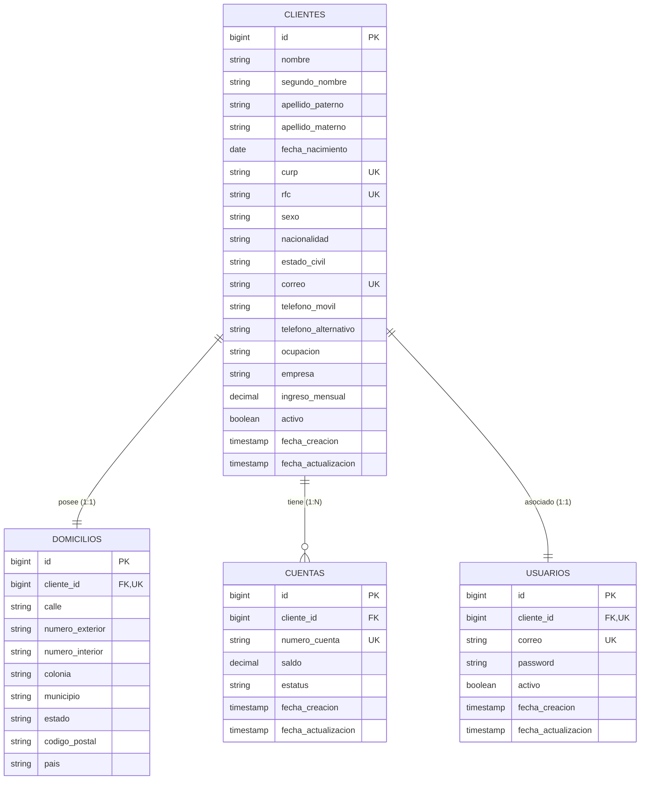

# Documentación Técnica: Sistema de Gestión Bancaria y Autenticación JWT

## 1. Visión General del Proyecto
Esta solución fue desarrollada en **Java 17** con **Spring Boot 3.3.6** para permitir a los ejecutivos de una institución financiera registrar clientes personas físicas, asignando automáticamente una cuenta bancaria única y un usuario de acceso autenticado mediante JWT.

---

## 2. Diagrama Entidad-Relación (ERD)

---

## 3. Requerimientos Implementados por Rama Feature

| Rama Feature | Requerimiento Funcional | Descripción / Resumen de Implementación |
| :--- | :--- | :--- |
| `feature/01-registro-cliente` | **1. Registro de Cliente** | Registro completo con datos personales, contacto, domicilio e información laboral. Validaciones de edad (>=18), regex de CURP/RFC, teléfono de 10 dígitos y CP de 5 dígitos. |
| `feature/02-creacion-cuenta` | **2. Creación Automática de Cuenta** | Creación automática de cuenta bancaria única (prefijo `7420` + 10 dígitos aleatorios), saldo inicial $0.00 (no negativo) y estatus `ACTIVA`. |
| `feature/03-consulta-informacion` | **3. Consulta de Información** | Endpoints para consultar clientes por ID, CURP, RFC, Correo, Número de Cuenta, clientes activos y filtrado por rango de fechas. |
| `feature/04-actualizacion-informacion` | **4. Actualización de Información** | Permite actualizar datos personales, contacto, domicilio y empleo. Bloquea estrictamente modificaciones a `CURP`, `RFC` y `numeroCuenta`. |
| `feature/05-baja-logica` | **5. Baja Lógica** | Marca el cliente como `activo = false` y en cascada desactiva sus cuentas (`INACTIVA`) y su usuario de acceso (`activo = false`). |
| `feature/06-creacion-usuario` | **6. Creación Automática de Usuario** | Generación de usuario usando el correo del cliente. Cifrado de contraseña con **BCrypt** y validación de complejidad (8+ chars, mayúscula, minúscula, número y carácter especial). |
| `feature/07-autenticacion-jwt` | **7. Inicio de Sesión (Login)** | Generación y validación de tokens JWT mediante `POST /auth/login`. Integración de filtro de seguridad `JwtAuthenticationFilter` en `SecurityConfig`. |

---

## 4. Catálogo de Endpoints de la API REST

### Autenticación
- `POST /auth/login`: Autentica al usuario (correo + password) y devuelve el token JWT Bearer.

### Clientes
- `POST /clientes`: Registro de cliente (Público / Ejecutivos).
- `GET /clientes`: Obtener todos los clientes.
- `GET /clientes/{id}`: Consulta por ID.
- `GET /clientes/curp/{curp}`: Consulta por CURP.
- `GET /clientes/rfc/{rfc}`: Consulta por RFC.
- `GET /clientes/correo/{correo}`: Consulta por correo electrónico.
- `GET /clientes/numero-cuenta/{numeroCuenta}`: Consulta cliente por número de cuenta.
- `GET /clientes/activos`: Consulta clientes activos.
- `GET /clientes/rango-fechas?inicio=YYYY-MM-DD&fin=YYYY-MM-DD`: Consulta por rango de fechas.
- `PUT /clientes/{id}`: Actualización de cliente (protege CURP/RFC/Número Cuenta).
- `DELETE /clientes/{id}`: Baja lógica de cliente y desactivación de recursos.

### Cuentas
- `GET /cuentas/{numeroCuenta}`: Consulta detalles de la cuenta.
- `GET /cuentas/activas`: Listar cuentas en estatus ACTIVA.
- `GET /cuentas/{numeroCuenta}/saldo`: Consulta únicamente del saldo de la cuenta.

### Usuarios
- `GET /usuarios/{id}`: Consultar usuario por ID.
- `PUT /usuarios/{id}/password`: Cambio de contraseña validando la contraseña actual y la complejidad.

---

## 5. Script de Creación de Base de Datos SQL

El script de creación de la base de datos se encuentra ubicado en:
- `src/main/resources/db/schema_banco.sql`
- Migración Flyway: `src/main/resources/db/migration/V4__create_banco_tables.sql`

---

## 6. Pruebas Unitarias e Integración
Se implementaron suites de prueba exhaustivas con JUnit 5 y Mockito:
- `ClienteServiceTest`: Pruebas de registro, mayoría de edad, duplicidad de CURP/RFC/Correo, restricción de modificación de CURP y baja lógica.
- `CuentaServiceTest`: Pruebas de generación de cuenta única y consulta de cuentas/saldo.
- `UsuarioServiceTest`: Pruebas de cifrado BCrypt, validación de fortaleza de contraseña y cambio de contraseña.
- `AuthServiceTest`: Pruebas de autenticación JWT, usuarios inactivos y credenciales inválidas.

---
